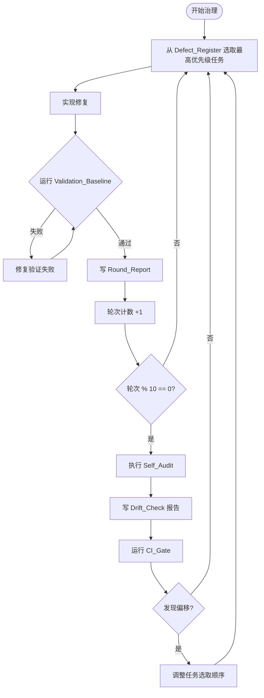

# Design Document: Iterative Dev Governance

## Overview

本设计文档描述 GShark-Sentinel **迭代式开发治理（iterative-dev-governance）** 系统的技术架构。

治理系统的核心目标是：让 Governance_Agent（Codex / Kiro）能够**自主、持续、可追溯**地消解已知架构缺陷，同时不中断主线能力交付。系统通过三个机制实现这一目标：

1. **Dev_Round 闭环**：每轮选取任务 → 实现 → 验证 → 写报告，形成完整的迭代单元。
2. **优先级驱动的任务选择**：P0 → P1 → P2 → P3 严格顺序，确保最高风险缺陷优先消解。
3. **Self_Audit 自检**：每十轮执行一次主题偏移检查，防止治理方向漂移。

本系统不引入新的运行时组件，也不修改现有 HTTP API 或前端路由。它是一套**操作规程与辅助工具集**，运行在 Governance_Agent 的执行上下文中，输出物是代码变更和 Report_Archive 中的文档。

---

## Architecture

### 整体结构

```
Governance_Agent (Codex / Kiro)
│
├── Round Controller          ← 控制 Dev_Round 生命周期
│   ├── Task Selector         ← 从 Defect_Register 按优先级选取任务
│   ├── Validation Runner     ← 执行 Validation_Baseline 和 CI_Gate
│   └── Self-Audit Trigger    ← 每十轮触发 Self_Audit
│
├── Report Writer             ← 写入 Round_Report 到 Report_Archive
│   ├── Archive Path Resolver ← 解析 docs/audit-development-report-archive-YYYY-MM-DD/
│   ├── Report Renderer       ← 渲染报告各节
│   └── README Updater        ← 更新 docs/README.md 归档说明
│
└── Defect Register           ← P0/P1/P2/P3 缺陷清单（静态输入）
```

### 执行流程



### 与现有项目结构的关系

| 现有组件 | 治理系统的交互方式 |
|---|---|
| `backend/internal/tshark/` | P0 缺陷修复目标：capability 降级策略、field scan cache key |
| `backend/internal/engine/` | P1/P2 缺陷修复目标：analysis_helpers.go 拆分、evidence 包边界 |
| `backend/internal/transport/` | P1 缺陷修复目标：BackendBridge 超级接口拆分 |
| `frontend/src/app/state/` | P1 缺陷修复目标：SentinelContext 状态 ownership |
| `frontend/src/app/integrations/` | P1 缺陷修复目标：前后端契约手写 mapper 替换 |
| `docs/audit-development-report-archive-*/` | 报告写入目标，遵循既有格式 |
| `./scripts/check-all.ps1` | CI_Gate，每轮必须通过 |

---

## Components and Interfaces

### 1. Defect Register（缺陷清单）

缺陷清单是治理系统的**静态输入**，不在运行时动态修改（Self_Audit 可调整选取顺序，但不删除条目）。

**P0 缺陷（最高优先级）**

| ID | 缺陷描述 | 关键文件 |
|---|---|---|
| P0-1 | tshark capability 降级策略：missing optional fields 应 graceful fallback 并记录日志，而非静默失败或返回空结果 | `backend/internal/tshark/capabilities.go`, `analysis_helpers.go` |
| P0-2 | field scan cache key 缺失：扫描参数组合无确定性 cache key，存在缓存污染风险 | `backend/internal/tshark/analysis_helpers.go` |
| P0-3 | `_ws.col.*` 字段等级过强：display-layer 字段（`_ws.col.Protocol`, `_ws.col.Info`）触发与 protocol-layer 异常相同的告警等级 | `backend/internal/tshark/capabilities.go` |
| P0-4 | 插件本地代码执行边界：插件执行本地代码前缺少显式沙箱或权限检查 | `backend/internal/plugin/` |

**P1 缺陷（高优先级）**

| ID | 缺陷描述 | 关键文件 |
|---|---|---|
| P1-1 | BackendBridge 超级接口：单一接口覆盖所有分析域，违反接口隔离原则 | `backend/internal/transport/http_server.go`, `engine.Service` |
| P1-2 | SentinelContext 状态 ownership：多个独立状态切片混合在单一 Context 中，存在跨切片直接 mutation | `frontend/src/app/state/SentinelContext.tsx` |
| P1-3 | useCaptureStartWorkflow 参数过大：参数列表过长，调用方难以维护 | `frontend/src/app/state/hooks/` |
| P1-4 | tool runtime config 持久化一致性：config 读写路径不统一，并发访问不安全 | `backend/internal/engine/tool_runtime.go` |
| P1-5 | 前后端契约手写 mapper：类型映射手写维护，缺少 round-trip 验证 | `frontend/src/app/integrations/` |

**P2 缺陷（中优先级）**

| ID | 缺陷描述 | 关键文件 |
|---|---|---|
| P2-1 | report/evidence 包级边界：包外代码直接导入 internal evidence 类型 | `backend/internal/engine/evidence*.go` |
| P2-2 | 规则硬编码：分析规则使用魔法数字/字符串，缺少命名常量或配置入口 | `backend/internal/tshark/industrial_rules.go` 等 |
| P2-3 | 前端 boundary check 深度不足：feature-level import boundary 未被 boundary script 覆盖 | `frontend/scripts/check-boundaries.mjs` |
| P2-4 | field scan cache 无容量控制：cache 可无限增长，存在内存泄漏风险 | `backend/internal/tshark/capabilities.go` |
| P2-5 | analysis_helpers.go 职责过重：单文件承担多个不相关分析辅助职责 | `backend/internal/tshark/analysis_helpers.go` |

**P3 缺陷（低优先级）**

| ID | 缺陷描述 | 关键文件 |
|---|---|---|
| P3-1 | 功能面过宽缺少成熟度标记：部分分析功能未标注 experimental/beta 状态 | 各 feature 入口 |
| P3-2 | 缺少真实 PCAP 回归矩阵：主要分析域缺少真实样本回归用例 | `backend/internal/engine/*_test.go` |

### 2. Round Controller

Round Controller 是 Governance_Agent 的执行主循环，负责协调各子组件。

**接口定义（伪代码）**

```go
// RoundState 表示当前轮次的执行状态
type RoundState struct {
    RoundNumber    int
    CurrentDefect  DefectEntry
    ModifiedFiles  []string
    ValidationPass bool
    StartedAt      time.Time
}

// TaskSelector 从 Defect_Register 按优先级选取下一个任务
type TaskSelector interface {
    // NextTask 返回最高优先级的未解决缺陷
    // 优先级顺序：P0 > P1 > P2 > P3
    // 同优先级内按 ID 顺序选取
    NextTask(register DefectRegister) (DefectEntry, bool)
}

// ValidationRunner 执行验证命令并返回结果
type ValidationRunner interface {
    RunBackendTests(ctx context.Context) ValidationResult
    RunFrontendCI(ctx context.Context) ValidationResult
    RunGofmt(ctx context.Context) ValidationResult
    RunTypecheck(ctx context.Context) ValidationResult
    RunCIGate(ctx context.Context) ValidationResult  // check-all.ps1
}
```

**优先级选取算法**

```
for priority in [P0, P1, P2, P3]:
    tasks = filter(register, priority=priority, status=open)
    if tasks is not empty:
        return tasks[0]  // 按 ID 顺序
return None  // 所有缺陷已解决
```

### 3. Report Writer

Report Writer 负责将 Round_Report 写入正确的 Report_Archive 路径。

**Archive Path Resolver**

```
archivePath(date) = "docs/audit-development-report-archive-" + format(date, "YYYY-MM-DD") + "/"
reportFile(date)  = archivePath(date) + "dev-governance-report-" + format(date, "YYYY-MM-DD") + ".md"
```

**报告文件命名约定**

- 每日第一轮：创建新文件 `dev-governance-report-YYYY-MM-DD.md`
- 同日后续轮次：追加到同一文件，使用 `## Progress Update - YYYY-MM-DD HH:MM:SS +08:00` 标题
- 跨日：在新日期目录创建新文件，不追加到前一天的文件

**Round_Report 结构**

```markdown
# 开发治理日报 - YYYY-MM-DD

署名: Codex
日期: YYYY-MM-DD HH:MM:SS +08:00

## 本轮目标

[本轮处理的 Defect_Register 条目，含优先级标签，如 P0: tshark capability 降级策略]

## 已完成改动

[每个修改的源文件，含简要说明]

## 验证记录

[Validation_Baseline 结果：backend go test ./... + frontend pnpm run ci]
[gofmt 检查结果]
[如有 TypeScript 修改，typecheck 结果]
[如有失败，记录每次修复尝试及结果]

## 当前缺陷与风险

[本轮未解决的风险，剩余 Defect_Register 条目概览]

## 下一步建议

[下一轮计划处理的缺陷条目]
```

**Self_Audit 追加格式**

```markdown
## Self-Audit Round N

[自检时间戳]

### 本阶段完成的 Defect_Register 条目

[已关闭缺陷列表，含关闭日期和轮次]

### 主题偏移检查

[是否有轮次偏离主线能力交付（入侵检测、威胁流量分析、证据链）]

### Defect_Register 优先级重排

[当前剩余条目是否需要重新排序]

### 下一阶段执行方向

[是否需要校正，校正内容]

### CI_Gate 结果

[./scripts/check-all.ps1 执行结果]

### 缺陷关闭汇总表

| 缺陷 ID | 描述 | 关闭日期 | 轮次 |
|---|---|---|---|
```

### 4. Self-Audit Trigger

```go
// ShouldTriggerSelfAudit 判断当前轮次是否需要执行 Self_Audit
// 规则：轮次计数为正整数且为 10 的倍数时触发
func ShouldTriggerSelfAudit(roundNumber int) bool {
    return roundNumber > 0 && roundNumber%10 == 0
}
```

---

## Data Models

### DefectEntry

```go
type Priority string

const (
    PriorityP0 Priority = "P0"
    PriorityP1 Priority = "P1"
    PriorityP2 Priority = "P2"
    PriorityP3 Priority = "P3"
)

type DefectStatus string

const (
    DefectOpen     DefectStatus = "open"
    DefectResolved DefectStatus = "resolved"
)

type DefectEntry struct {
    ID          string       // e.g. "P0-1"
    Priority    Priority
    Title       string       // 简短描述
    Description string       // 详细描述
    KeyFiles    []string     // 主要涉及文件
    Status      DefectStatus
    ResolvedAt  *time.Time
    ResolvedIn  int          // 解决时的轮次编号
}

type DefectRegister struct {
    Entries []DefectEntry
}
```

### RoundReport

```go
type ValidationResult struct {
    Command string
    Pass    bool
    Output  string
    Attempts []ValidationAttempt
}

type ValidationAttempt struct {
    AttemptNumber int
    Output        string
    Pass          bool
}

type RoundReport struct {
    RoundNumber     int
    Author          string    // "Codex"
    Timestamp       time.Time
    Timezone        string    // "+08:00"
    Defect          DefectEntry
    ModifiedFiles   []string
    Validations     []ValidationResult
    RisksAndDefects string
    NextSteps       string
}
```

### SelfAuditReport

```go
type DefectClosure struct {
    DefectID    string
    Title       string
    ResolvedAt  time.Time
    RoundNumber int
}

type SelfAuditReport struct {
    RoundNumber      int
    Timestamp        time.Time
    CompletedDefects []DefectClosure
    DriftDetected    bool
    DriftDescription string
    PriorityAdjusted bool
    DirectionNote    string
    CIGateResult     ValidationResult
}
```

### ArchivePath

```go
type ArchivePath struct {
    Date      time.Time
    Directory string  // docs/audit-development-report-archive-YYYY-MM-DD/
    ReportFile string // docs/audit-development-report-archive-YYYY-MM-DD/dev-governance-report-YYYY-MM-DD.md
    ReadmeFile string // docs/audit-development-report-archive-YYYY-MM-DD/README.md
}

func ResolveArchivePath(date time.Time) ArchivePath {
    dateStr := date.Format("2006-01-02")
    dir := fmt.Sprintf("docs/audit-development-report-archive-%s/", dateStr)
    return ArchivePath{
        Date:       date,
        Directory:  dir,
        ReportFile: dir + "dev-governance-report-" + dateStr + ".md",
        ReadmeFile: dir + "README.md",
    }
}
```

---

## Correctness Properties

*A property is a characteristic or behavior that should hold true across all valid executions of a system — essentially, a formal statement about what the system should do. Properties serve as the bridge between human-readable specifications and machine-verifiable correctness guarantees.*

### Property 1: Archive path date formatting is correct

*For any* valid `time.Time` value, `ResolveArchivePath(date).Directory` shall produce a string of the form `docs/audit-development-report-archive-YYYY-MM-DD/` with correct zero-padding for month and day.

**Validates: Requirements 1.1**

---

### Property 2: Round_Report contains all required sections in order

*For any* valid `RoundReport` value, the rendered report string shall contain the five required section headings — 本轮目标、已完成改动、验证记录、当前缺陷与风险、下一步建议 — and they shall appear in that order.

**Validates: Requirements 1.2**

---

### Property 3: Round_Report header contains author and timestamp

*For any* valid `RoundReport` value, the rendered report string shall contain both `署名: Codex` and a timestamp line matching `日期: YYYY-MM-DD HH:MM:SS +08:00` within the first 10 lines.

**Validates: Requirements 1.3**

---

### Property 4: Modified files are all listed in 已完成改动

*For any* `RoundReport` with a non-empty `ModifiedFiles` slice, every file path in `ModifiedFiles` shall appear as a substring in the rendered report's 已完成改动 section.

**Validates: Requirements 1.6**

---

### Property 5: Progress Update heading uses correct format

*For any* valid `time.Time` value used as an append timestamp, the generated Progress Update heading shall match `## Progress Update - YYYY-MM-DD HH:MM:SS +08:00` with correct zero-padding.

**Validates: Requirements 1.5**

---

### Property 6: Task selector always returns highest-priority open defect

*For any* non-empty `DefectRegister` containing defects at mixed priority levels (P0–P3), `TaskSelector.NextTask` shall return a defect whose priority is the lowest ordinal (P0 < P1 < P2 < P3) among all open defects in the register.

**Validates: Requirements 2.4, 4.1**

---

### Property 7: Self-Audit trigger fires exactly on multiples of ten

*For any* positive integer `n`, `ShouldTriggerSelfAudit(n)` shall return `true` if and only if `n % 10 == 0`.

**Validates: Requirements 3.1**

---

### Property 8: Self-Audit heading contains correct round number

*For any* positive integer round number `N`, the generated Self-Audit section heading shall be exactly `## Self-Audit Round N`.

**Validates: Requirements 3.2**

---

### Property 9: Report writer does not append across date boundaries

*For any* `RoundReport` whose `Timestamp` date differs from the date embedded in an existing report file path, the report writer shall create a new file in the new date's archive directory rather than appending to the existing file.

**Validates: Requirements 8.3**

---

### Property 10: Defect closure table contains all resolved defects

*For any* `SelfAuditReport` with a non-empty `CompletedDefects` slice, the rendered self-audit report shall contain every `DefectClosure.DefectID` and its corresponding `RoundNumber` in the closure table.

**Validates: Requirements 8.6**

---

### Property 11: Tshark optional-field degradation returns partial results

*For any* subset of optional tshark fields that are absent from the field registry, the capability-aware analysis function shall return a non-empty partial result (not an empty/nil result) and shall include a non-empty `MissingOptionalFields` list in the returned `Capabilities`.

**Validates: Requirements 4.2**

---

### Property 12: Field scan cache key is deterministic and collision-resistant

*For any* two distinct scan parameter objects `a` and `b` (where "distinct" means at least one field differs), `CacheKey(a) != CacheKey(b)`. Additionally, for any scan parameter object `p`, repeated calls to `CacheKey(p)` shall return the same value.

**Validates: Requirements 4.3**

---

### Property 13: Contract mapper round-trip preserves data

*For any* valid frontend/backend contract type instance `x`, `decode(encode(x))` shall produce a value equal to `x` under the contract type's equality definition.

**Validates: Requirements 5.6**

---

### Property 14: Field scan cache never exceeds configured capacity

*For any* sequence of cache insertions where the total number of distinct keys exceeds the configured maximum capacity `maxEntries`, the cache size (number of stored entries) shall never exceed `maxEntries` at any point after each insertion.

**Validates: Requirements 6.5**

---

## Error Handling

### Validation Failure Recovery

每轮验证失败时，Governance_Agent 必须在同一轮内修复，不得跨轮遗留失败状态。

```
验证失败处理流程：
1. 记录失败命令和输出
2. 分析失败原因（编译错误 / 测试失败 / 格式问题 / 类型错误）
3. 实施修复
4. 重新运行失败的验证命令
5. 如仍失败，重复步骤 2-4，并在报告中记录每次尝试
6. 验证通过后，继续写报告
```

**不允许的行为：**
- 跳过失败的验证命令继续写报告
- 在验证失败时开始下一轮
- 使用 `--no-verify` 绕过 git hooks

### Archive Directory Creation Failure

如果 Report_Archive 目录创建失败（权限问题、磁盘空间不足等），Governance_Agent 应：
1. 记录错误到当前会话日志
2. 尝试写入临时位置（项目根目录的 `governance-report-fallback-YYYY-MM-DD.md`）
3. 在下一轮开始前重试目录创建

### Defect Register Exhaustion

当所有优先级的缺陷均已解决时：
1. 执行最终 Self_Audit（无论当前轮次是否为 10 的倍数）
2. 写入最终报告，标注"所有已知架构缺陷已消解"
3. 停止自主迭代，等待用户提供新的治理输入

### CI_Gate Failure in Self_Audit

Self_Audit 中 CI_Gate 失败时：
1. 将失败结果记录在 Drift_Check 报告中
2. 将 CI 修复作为下一轮的最高优先级任务（临时超越 P0 缺陷）
3. 修复完成后重新运行 CI_Gate 并更新 Drift_Check 报告

---

## Testing Strategy

### 单元测试

针对以下纯函数编写单元测试：

| 函数 | 测试重点 |
|---|---|
| `ResolveArchivePath(date)` | 日期格式化、零填充、路径拼接 |
| `ShouldTriggerSelfAudit(n)` | 边界值：0, 1, 9, 10, 11, 20, 100 |
| `TaskSelector.NextTask(register)` | 空 register、单优先级、混合优先级、全部已解决 |
| `RenderRoundReport(report)` | 节顺序、必填字段存在性、文件列表完整性 |
| `RenderSelfAuditHeading(n)` | 任意正整数 N |
| `RenderProgressUpdateHeading(t)` | 时间戳格式化 |
| `CacheKey(params)` | 确定性、碰撞抵抗 |

### 属性测试

使用 Go 的 `testing/quick` 包或 `pgregory.net/rapid` 进行属性测试。

**测试配置：** 每个属性测试最少运行 100 次迭代。

**标注格式：** 每个属性测试用注释标注对应的设计属性：

```go
// Feature: iterative-dev-governance, Property 1: Archive path date formatting is correct
func TestArchivePathFormatting(t *testing.T) { ... }
```

**属性测试覆盖：**

| 属性 | 测试库 | 生成器 |
|---|---|---|
| Property 1: Archive path formatting | `testing/quick` | 随机 `time.Time` |
| Property 2: Report sections in order | `testing/quick` | 随机 `RoundReport` |
| Property 3: Report header fields | `testing/quick` | 随机 `RoundReport` |
| Property 4: Modified files listed | `testing/quick` | 随机文件路径切片 |
| Property 5: Progress Update heading | `testing/quick` | 随机 `time.Time` |
| Property 6: Task selector priority | `pgregory.net/rapid` | 随机 `DefectRegister`（混合优先级）|
| Property 7: Self-Audit trigger | `testing/quick` | 随机正整数 |
| Property 8: Self-Audit heading | `testing/quick` | 随机正整数 |
| Property 9: No cross-date append | `testing/quick` | 随机日期对 |
| Property 10: Closure table completeness | `testing/quick` | 随机 `[]DefectClosure` |
| Property 11: Tshark degradation partial result | `pgregory.net/rapid` | 随机 optional field 子集 |
| Property 12: Cache key determinism | `pgregory.net/rapid` | 随机 scan params 对 |
| Property 13: Contract mapper round-trip | `pgregory.net/rapid` | 随机 contract type 实例 |
| Property 14: Cache capacity invariant | `pgregory.net/rapid` | 随机插入序列 + 随机 maxEntries |

### 集成测试

以下场景使用集成测试（1-3 个示例，不使用属性测试）：

| 场景 | 测试方式 |
|---|---|
| Report_Archive 目录创建 + README.md 生成 | 临时目录 + 文件系统断言 |
| docs/README.md 归档说明更新 | 临时文件 + 内容断言 |
| Validation_Baseline 命令执行 | 模拟命令执行器 |
| CI_Gate 执行与结果记录 | 模拟命令执行器 |
| 插件权限检查边界（P0-4） | 模拟插件执行器 |

### 验证基线（每轮必须通过）

每轮 Dev_Round 结束前必须通过以下验证：

```powershell
# 后端测试
cd backend && go test ./...

# 后端格式检查
cd backend && gofmt -l .

# 前端 CI（含 typecheck、lint、format、size、vitest、build）
cd frontend && pnpm run ci

# 如有 TypeScript 修改
cd frontend && pnpm run typecheck

# 完整 CI（Self_Audit 时额外运行）
./scripts/check-all.ps1
```

### 测试文件位置

治理系统辅助工具的测试文件放置在：

```
backend/internal/governance/
├── archive_path_test.go      ← Property 1, 9
├── report_render_test.go     ← Property 2, 3, 4, 5, 8, 10
├── task_selector_test.go     ← Property 6
├── self_audit_test.go        ← Property 7
└── integration_test.go       ← 集成测试
```

注意：`backend/internal/governance/` 是本 spec 新增的辅助包，仅包含治理工具函数，不引入任何 HTTP 路由或运行时依赖。
