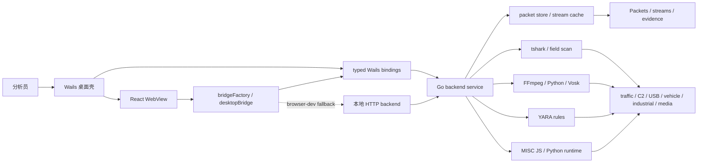
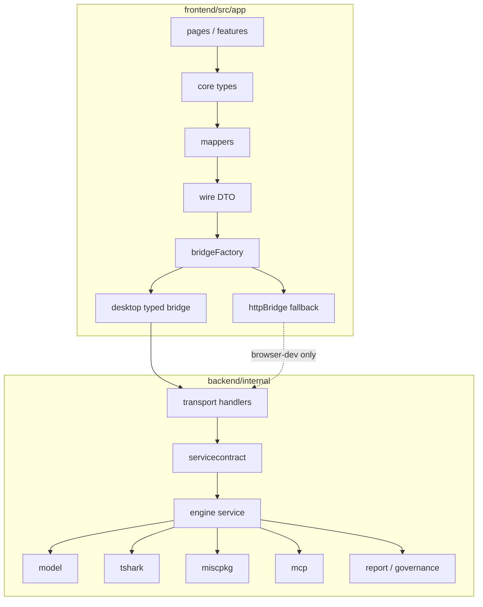
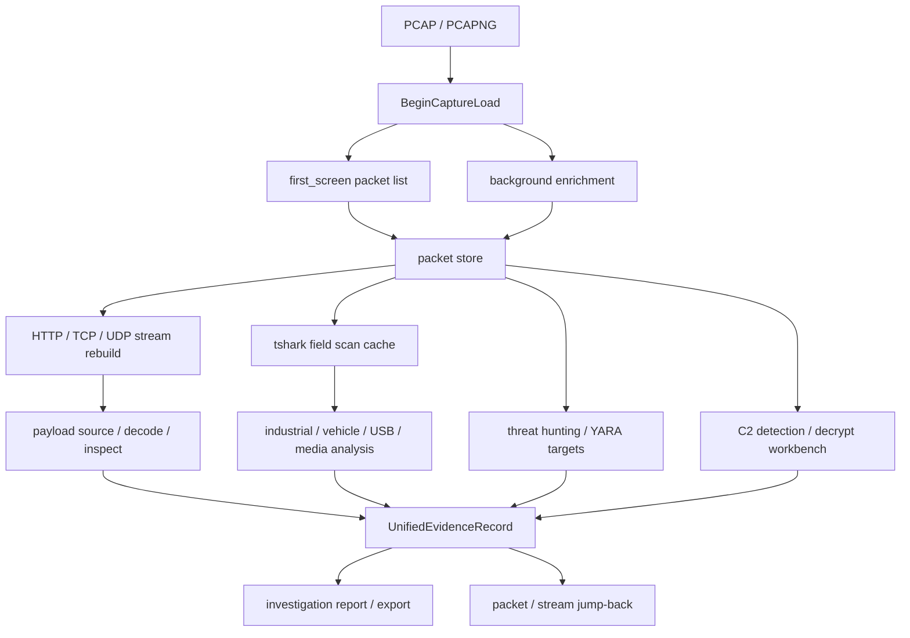
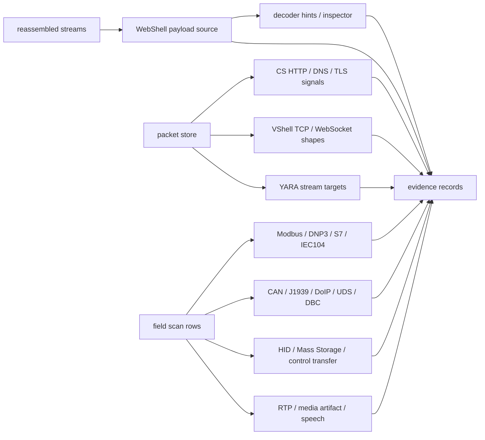
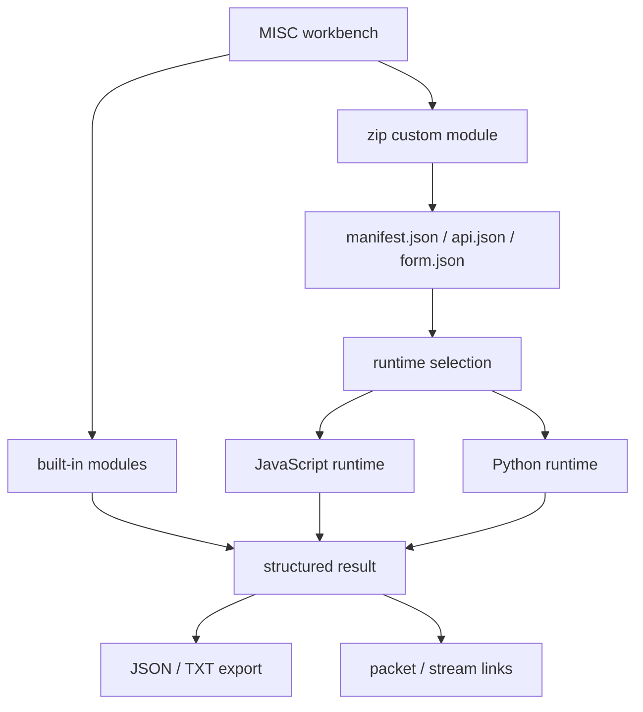

# meow~traffic

meow~traffic 是一款面向安全分析师、CTF 选手、应急响应人员、协议研究和危险应用分析场景的桌面端离线流量分析工具。项目以 `tshark` 为解析核心，前端提供高信息密度的分析工作区与专项页面，后端负责抓包加载、分页、流重组、对象提取、协议专项分析、威胁狩猎和 MISC 模块执行。

> 品牌已更名为 `meow~traffic`；为保持兼容，仓库、Go module path、`MEOW_TRAFFIC_*` 环境变量和 `meow-traffic` 目录名等内部标识仍暂时保留旧名。`sentinel-backend.exe` 只作为历史发布/归档词汇保留，当前 Wails 桌面构建不再嵌入或启动后端二进制。

## 核心特性

- 离线 PCAP / PCAPNG 加载、分页浏览、包定位和显示过滤。
- 数据包列表、协议树、Hexdump、tshark 原始列值联动查看。
- HTTP / TCP / UDP 流重组，支持从分析结果回跳原始包和关联流。
- 对象提取、TLS 解密配置、流量图、威胁狩猎和规则匹配。
- 工控、车机、媒体、USB 等专项分析页面。
- MISC 工具箱支持内建协议辅助工具和 zip 自定义模块。
- JavaScript / Python 扩展运行时，用于 MISC 自定义模块等本地扩展能力。

## 技术栈

- 桌面框架：Wails v2
- 后端：Go 1.22+（桌面壳）/ Go 1.25（后端模块）
- 前端：React 18、TypeScript、Vite、Tailwind CSS、Radix UI
- 解析核心：tshark
- 本地通信：Wails IPC 桌面代理 + 本地 HTTP 后端；普通浏览器模式保留 HTTP / SSE fallback
- 扩展运行时：JavaScript、Python

## 架构建模与核心流程

meow~traffic 采用“桌面壳 + React 工作台 + 本地 Go 后端 + 外部解析工具”的离线分析架构。桌面端主线是 Wails typed IPC：前端页面通过 `desktopBridge` 调用明确的桌面 binding；普通浏览器开发模式保留 HTTP / SSE fallback。后端不使用 Web 框架，HTTP router 由 `net/http.ServeMux` 直接注册，核心业务集中在 `backend/internal/engine`，协议解析和专项字段扫描集中在 `backend/internal/tshark`。

### 系统上下文



这张图体现当前运行时边界：React 只负责交互和状态编排，桌面模式不再依赖 WebView 直接请求后端 `/api/...` 数据面；后端服务统一承接 capture、packet、stream、analysis、report、MISC 和 runtime 探测。`tshark`、FFmpeg、Python/Vosk 与 YARA 都是可探测的本地能力，缺失时按专项功能降级，而不是让主工作区不可用。

### 前后端数据面



前端数据面遵循 `wire DTO -> mapper -> core type -> feature/page` 的方向。页面和 feature hook 不直接绑定后端 JSON shape；mapper 负责把传输 DTO 归一化为前端核心类型。后端 HTTP handler 必须使用 request context 进入 service 层，长任务和 capture replacement 才能正确取消。

### PCAP 到证据结论



核心算法流程分成两条节奏：首屏先用轻量字段集把包列表提交给前端，后台再补齐颜色、UDP payload、checksum 和专项协议辅助字段；分析页面按需读取 packet store、stream cache 或 field scan cache，最终聚合为统一证据记录和调查报告。这样能在大包场景下先进入工作台，再逐步补齐高成本分析。

### 检测与专项算法



C2 检测侧重多信号聚合：HTTP Host/URI 周期性、GET/POST tasking shape、DNS 长标签/TXT/NULL、TLS 指纹、VShell WebSocket 参数、长度前缀和短长包交替等都会进入候选、聚合和置信度因子。WebShell 流程先从 URI、form、multipart、JSON、HTTP body 和流内容中提取 payload source，再由 decoder / inspector 给出家族、解码建议和证据提示。工控、车机、USB、媒体等专项分析优先使用 tshark 字段扫描缓存，避免在页面切换时重复启动外部解析。

### MISC 模块执行



MISC 不是通用插件沙箱，而是面向低频、高价值协议辅助任务的本地模块接口。内建模块直接复用后端 service 和 packet/stream 能力；自定义 zip 模块必须通过 manifest、api 和 form 描述输入输出，运行时限制在本地 JavaScript / Python 执行器内，结果以结构化 JSON 返回前端工作台。

## 功能概览

### 主工作区

- 抓包文件加载、分页、跳页和包号定位。
- 显示过滤表达式直接使用 tshark display filter 语义。
- 协议树、Hexdump、原始协议列和选中包联动。
- 从选中包跟踪 HTTP / TCP / UDP 流。
- 支持包级证据回跳，便于从专项结论追溯原始上下文。

### 流与对象

- HTTP stream 查看与搜索。
- TCP / UDP 原始流分页查看。
- 流内容解码工作台。
- 对象提取、预览和导出。
- TLS key log / 私钥配置辅助。

### 专项协议分析

- 工控分析：Modbus、S7comm、DNP3、CIP / EtherNet-IP、PROFINET、BACnet、IEC 104、OPC UA。
- 车机分析：CAN、J1939、DoIP、UDS、OBD-II、CANopen。
- CAN DBC 导入、信号解码和时间线预览。
- 媒体流分析、播放素材生成、语音转写和批量导出。
- USB HID、Mass Storage、控制传输与原始包分析。
- 威胁狩猎中心和规则匹配。

### MISC 工具箱

MISC 工具箱用于承载低频但高价值的协议辅助能力。当前内建模块包括：

- HTTP 登录行为分析：聚合登录/认证请求，识别成功、失败、二次验证和疑似爆破。
- SMTP 会话重建：还原认证、发件人、收件人、邮件内容和附件线索。
- MySQL 会话重建：提取握手、登录用户、默认库、SQL、OK/ERR 和结果集响应。
- Shiro rememberMe 分析：定位 rememberMe Cookie，识别 deleteMe 痕迹，测试默认/自定义 AES key。
- NTLM 会话材料中心：统一提取 HTTP / WinRM / SMB3 中的 challenge、NT proof、session key 和方向信息。
- WinRM 解密辅助：对 WinRM over HTTP + NTLM 流量做明文提取、预览和导出。
- SMB3 Random Session Key：基于 SMB3 / NTLM 会话材料辅助生成 Random Session Key。

MISC 模块特性：

- 内建模块支持统一卡片式工作台。
- 结构化结果支持 JSON / TXT 导出。
- 协议线索可联动包号定位和关联流跳转。
- 支持导入 zip 自定义模块。
- 自定义模块以 `manifest.json + api.json + form.json + backend.js/.py` 交付。
- 自定义模块可使用 JavaScript 或 Python 运行时。

相关文档：

- [项目开发指南](./docs/project-development-guide.md)
- [设计与工程约束](./docs/project-design-and-constraints.md)
- [架构总览与流程图](./docs/architecture/README.md)
- [HTTP OpenAPI 文档](./docs/api/openapi.yaml)
- [本地 MCP 接入文档](./docs/mcp-interface.md)
- [MISC 模块接口文档](./docs/misc-module-interface.md)

## 扩展方式

### MISC 自定义模块

MISC 自定义模块适合把轻量、低频、强场景化的辅助工具接入桌面工作台，例如：

- 字段提取；
- 协议辅助分析；
- 文本解码；
- key / token / IOC 快速处理；
- 针对单类题目或单类流量的专用小工具。

脚手架：

```powershell
powershell -ExecutionPolicy Bypass -File .\scripts\new-misc-module.ps1 -Id echo-demo -Title "Echo Demo" -Runtime javascript -Zip
```

Python 模块示例：

```powershell
powershell -ExecutionPolicy Bypass -File .\scripts\new-misc-module.ps1 -Id py-scan-demo -Title "Python Scan Demo" -Runtime python -Zip
```

示例模块：

- [examples/misc-modules/echo-demo](./examples/misc-modules/echo-demo)

## 目录结构

```text
.
├─ frontend/              React 前端、页面、组件和 Wails bridge
├─ backend/               Go 后端、tshark 封装、协议分析和模块运行
├─ docs/                  接口文档、方案文档和教程
├─ examples/              示例插件和 MISC 模块
├─ scripts/               启动、构建、发布和脚手架脚本
├─ app.go                 Wails 桌面壳桥接入口
├─ main.go                桌面应用入口
└─ wails.json             Wails 配置
```

## 环境要求

- Windows 环境下开发体验最佳。
- Go 1.22+（桌面壳）/ Go 1.25（后端模块，go.work 统一管理）。
- Node.js 20+。
- pnpm。
- Wireshark / tshark。

说明：

- 如果系统 `PATH` 中找不到 `tshark`，应用启动后会要求填写 `tshark.exe` 路径或 Wireshark 安装目录。
- 如果 `PATH` 中已有可用 `tshark`，应用会直接使用。
- 后端进程会读取 `MEOW_TRAFFIC_FFMPEG`、`MEOW_TRAFFIC_PYTHON`、`MEOW_TRAFFIC_VOSK_MODEL` 作为 FFmpeg、Python 与 Vosk 模型目录的显式配置；这些值会显示在运行时组件设置的“显式配置”输入框中。
- 运行时组件设置里的输入框为空，不等于组件不可用。输入框代表用户固定保存的显式路径；下方状态卡显示后端从环境变量、`PATH` 或默认目录探测到的当前实际路径。
- 保存空的 FFmpeg / Python / Vosk 字段会清除当前后端进程中的对应 `MEOW_TRAFFIC_*` 显式配置，随后回到 `PATH` 或默认目录探测。
- 旧版前端可能留下全空的运行时配置缓存；新版启动会把这类缓存迁移为“自动观测配置”，不会再用空值覆盖后端进程已经读取到的 `MEOW_TRAFFIC_*` 环境变量。只有用户在设置侧栏点击“保存并应用”的字段才会作为显式配置写回后端。
- `tshark` 能力探测中出现 `profile=compat` 或缺少可选字段时，表示部分专项分析降级，不表示 `tshark` 不可用。4.6.5 中 USB Mass Storage SCSI opcode 使用 `scsi.spc.opcode`，后端会兼容旧请求名 `usbms.scsi.opcode`。抓包入口只以 `tshark.available` 作为可用判断。
- 语音转写状态会拆分显示 Python、`vosk` 包、Vosk 模型目录和 FFmpeg。Python 已就绪但默认模型目录不存在时，`speech.available=false` 是模型缺失，不是 Python 不可读。
- Wails 配置默认使用 `pnpm install` 和 `pnpm run build:wails`。

## 快速启动

一键桌面开发启动：

```powershell
powershell -ExecutionPolicy Bypass -File .\scripts\start-dev.ps1
```

直接启动 Wails 开发模式：

```powershell
powershell -ExecutionPolicy Bypass -File .\scripts\start-wails-dev.ps1
```

说明：

- 项目当前是桌面端优先工作流。
- `scripts/start-dev.ps1` 会委托给 `scripts/start-wails-dev.ps1`。
- `start-wails-dev.ps1` 默认会清理历史残留的 `frontend/dist/sentinel-backend.exe`、`build/bin/sentinel-backend.exe` 和 `%TEMP%\meow-traffic\backend`。当前 Wails 桌面已在进程内挂载后端 runtime，不再复用这些后端二进制。
- Wails 桌面环境的运行时组件探测走 Wails typed IPC；HTTP 只保留给普通 browser-dev/CLI 模式。这样可以避免“后端已连接，但 `/api/tools/runtime-config` 因 token、origin 或端口复用失败导致设置页全是未检测”的链路分裂。
- 启动页和运行时组件设置都提供“重新探测工具”，用于重新读取 TShark、FFmpeg、Python/Vosk 与 YARA 状态。运行时探测分为快速状态和完整能力探测：启动时先读取 `probe=fast`，只确认路径、解释器和模型目录等低成本状态；随后后台执行 `probe=full`，再补齐 TShark 字段能力、Python `vosk` 包和 YARA 规则包等慢探测。Wails 桌面探测链路应显示 Wails IPC；HTTP 仅用于普通 browser-dev。
- `/api/tools/runtime-config` 默认保持完整探测；前端启动和手动刷新会显式请求 `?probe=fast`，避免 3500ms 启动预算被 TShark `-G fields` 或 Python `import vosk` 等慢探测拖成“工具不可读”。Wails IPC 快速探测若 2 秒内没有返回，会直接报告 IPC 超时端点，阻止构建产物静默切回 HTTP。
- `/api/runtime/identity` 会返回后端 `build_id`、可执行文件路径、工作目录和启动时间；`start-wails-dev.ps1` 也会输出端口和探测提示。若控制台仍出现旧文案 `tshark capability: ... missing optional fields ...`，优先检查旧后端进程、旧二进制或缓存，而不是把它判断为 TShark 不可读。
- `tshark capability degraded ... optional fields missing ... (tshark remains available)` 只表示可选字段降级，不表示 TShark 不可用。
- 抓包首屏加载默认使用轻量 `first_screen` 字段集快速生成包列表；颜色特征、UDP payload、checksum 和专项协议辅助字段会通过后台 enrichment 补齐，不阻塞进入工作区。
- 预加载诊断中的 `page=0/0 status=-` 表示前端读到的 committed capture 仍为空。若后端正在解析，`/api/capture/status` 会同时返回 `load.phase`、`parser_profile`、`processed`、`accepted`、`staged_count` 等 active load 信息，前端会显示“后端正在解析，尚未提交首屏数据”，而不是误报首屏数据失败。
- Wails 桌面环境下页面数据面已迁移为 typed IPC 优先：React WebView 通过 `desktopBridge` 调用明确的 Wails typed binding，缺少已迁移数据面的 typed binding 时会以 `generic_ipc_disabled` 失败，不再恢复 generic IPC 后端代理，也不静默回退浏览器 HTTP。C2、工控、车机、USB、APT、证据、对象、流、媒体、插件、狩猎、MISC 上传和导出等长尾页面不再直接从 WebView `fetch` 后端 `/api/...`。
- Wails 桌面环境中，已迁移 typed IPC 调用失败会直接显示 IPC 端点和原因，不再静默回退浏览器 HTTP。旧 generic IPC backend/generated binding 已移除；`VITE_DESKTOP_GENERIC_IPC_POLICY=compat` 仅保留为可识别的 no-op 策略值。普通 browser-dev HTTP/SSE 调试模式继续使用 `httpBridge`、HTTP token、统一超时和错误分类。
- Wails 桌面事件不再由 WebView 直连 `/api/events`；桌面壳从进程内 `transport.Hub` 订阅事件并转发 `meow:backend:*` Wails runtime events。DevTools Network 中页面数据 API 不应再出现对 `127.0.0.1:17891/api/...` 的直接请求，静态资源和 Vite 开发请求除外。
- Wails typed IPC 控制面也带本地 timeout / abort 保护：capture status、packet page、start/stop、TLS 和运行时探测不会因为 binding promise 悬挂而让页面无限 loading。调用方取消 `AbortSignal` 时会保留 `AbortError` 语义。
- 桌面 IPC blob 响应默认限制为 50MB。超过上限时会显示“桌面 IPC blob 响应过大”，避免 base64 放大导致 WebView 内存尖峰；大文件导出后续应改原生保存或流式传输。
- 桌面事件桥直接订阅进程内 `transport.Hub`：不创建 HTTP client，不连接 `/api/events`，收到 `ready/status/packet/error` 后转发为 Wails runtime event。

## 测试与验证

统一校验：

```powershell
powershell -ExecutionPolicy Bypass -File .\scripts\check-all.ps1
```

后端测试：

```powershell
cd backend
go test ./...
```

后端覆盖率报告：

```powershell
cd backend
go test ./... -covermode=count -coverprofile="$env:TEMP\gshark-backend-cover.out"
go tool cover -func="$env:TEMP\gshark-backend-cover.out"
```

当前后端测试面已覆盖 transport contract、servicecontract、report、MCP、tshark 专项解析、C2 聚合与解密辅助、WebShell payload inspector、stream cache/index/fallback 等高风险路径。最近一次精算基线为 `18734 / 22014` statements，总覆盖率 `85.1%`；覆盖率是质量观察指标，实际门禁仍以 focused contract tests、全量 `go test ./...` 和 `scripts/check-all.ps1` 为准。

前端测试：

```powershell
cd frontend
pnpm run test:run
```

前端生产构建：

```powershell
cd frontend
pnpm run build
```

说明：`pnpm run build` 只执行 Vite 静态前端构建，不能作为桌面运行验收。它不会保证 `frontend/dist` 中存在桌面所需的 YARA 规则等非二进制资源。

桌面资源构建：

```powershell
cd frontend
pnpm run build:wails
```

`build:wails` 会在 Vite 构建后同步 `rules/yara/default.yar` 等非二进制桌面资源，并删除历史残留的 `sentinel-backend.exe`，随后执行桌面资源检查。也可以单独运行：

```powershell
powershell -ExecutionPolicy Bypass -File .\scripts\check-desktop-assets.ps1
```

## 构建与发布

构建桌面应用：

```powershell
wails build
```

准备发布包与 `version.json`：

```powershell
python .\scripts\build_release_package.py v0.0.5
```

复用现有 exe 并跳过构建：

```powershell
python .\scripts\build_release_package.py v0.0.5 --skip-build
```

发布脚本默认行为：

- 执行桌面应用构建；
- 整理发布包到 `release/out/<version>/`；
- 生成 `release/out/<version>/version.json`；
- 同步更新仓库内的 `release/version.json`；
- 优先读取 `release/notes/<version>.md` 作为 release notes。

## 文档入口

- [文档中心](./docs/README.md)
- [项目整体模型](./docs/project-model.md)
- [项目开发指南](./docs/project-development-guide.md)
- [设计与工程约束](./docs/project-design-and-constraints.md)
- [工程化全量审计方案](./docs/engineering-full-audit-plan.md)
- [全量一期治理登记表](./docs/full-governance-phase1-register.md)
- [架构总览与 Mermaid 流程图](./docs/architecture/README.md)
- [HTTP OpenAPI 文档](./docs/api/openapi.yaml)
- [MISC 模块接口文档](./docs/misc-module-interface.md)
- [车机流量分析方案](./docs/automotive-analysis-plan.md)
- [车机流量分析 0 基础教程](./docs/automotive-analysis-zero-basics.md)
- [车机与工控分析重点说明](./docs/ctf-vehicle-industrial-focus.md)

当前权威事实优先级：代码与 CI 配置 → `AGENTS.md` → 根 README / `docs/README.md` → 接口与架构文档 → 历史审计归档。`docs/audit-development-report-archive-*` 只作为历史证据，不直接代表当前实现。

新增 HTTP route、typed Wails binding、核心类型、MISC 接口或 CI 约束时，必须同步更新对应权威文档或 `docs/api/openapi.yaml`。

## 当前边界

- 显示过滤直接使用 tshark display filter 语义，表达式无效时按 tshark 错误处理。
- Python / JavaScript 以外的扩展运行时尚未打通。
- zip 自定义模块当前使用统一卡片模板，不支持自定义前端样式。
- DBC 当前优先支持常见 `BO_ / SG_` 语法，multiplexing 与 ARXML 仍需继续扩展。
- 超大流和超大抓包场景下，部分专项模块仍需要更细的增量化优化。

## 适用场景

- CTF 流量题分析；
- 应急响应中的离线包取证；
- 协议专项排查；
- 工控流量审计；
- 车载网络抓包研判；
- 危险应用和威胁流量分析；
- 低频但高价值的安全辅助工具集成。

## 许可与说明

本仓库中的示例流量、规则、模块、插件和文档可能随着分析能力扩展继续调整。若要新增协议分析能力，建议优先在后端增加字段提取与聚合逻辑，再在前端页面中增加可视化结果；若只是补一个轻量辅助工具，优先考虑接入 MISC zip 模块体系。
