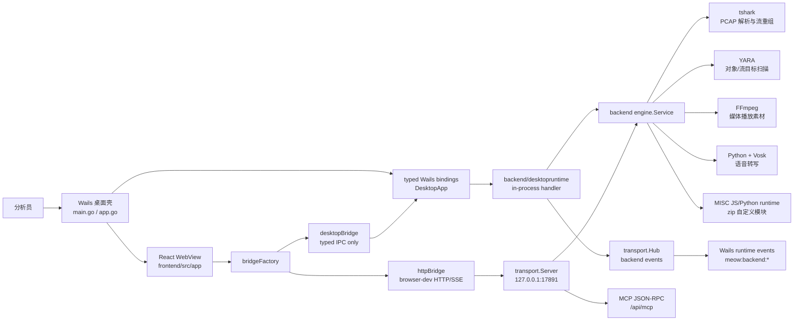
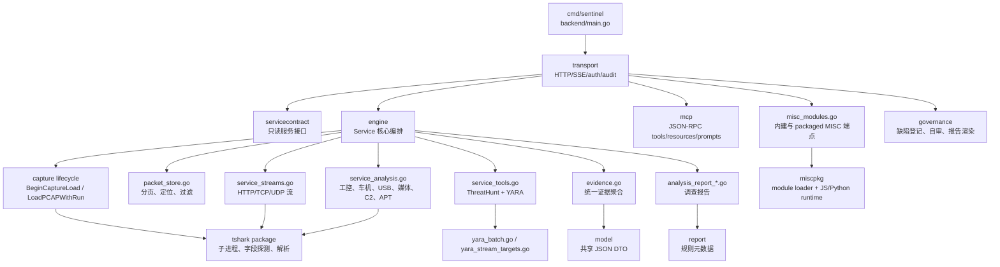
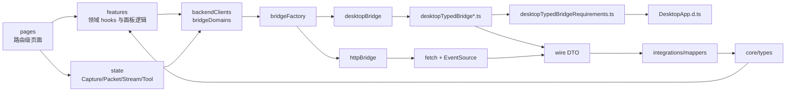
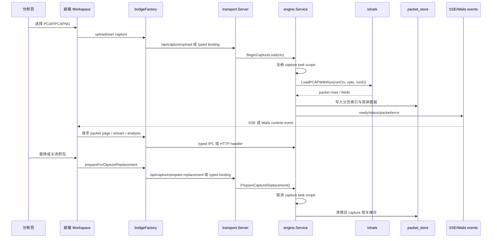
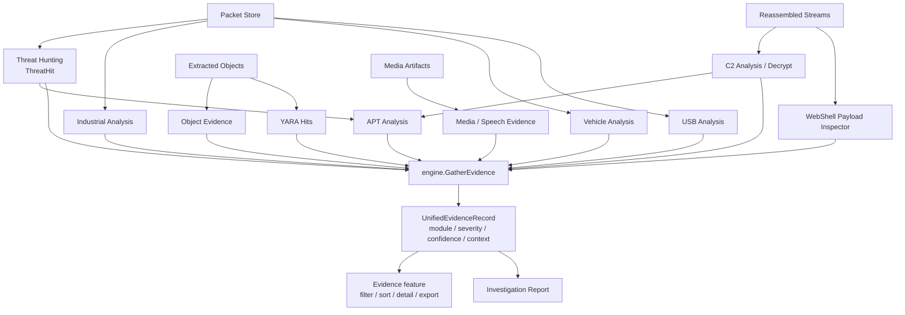
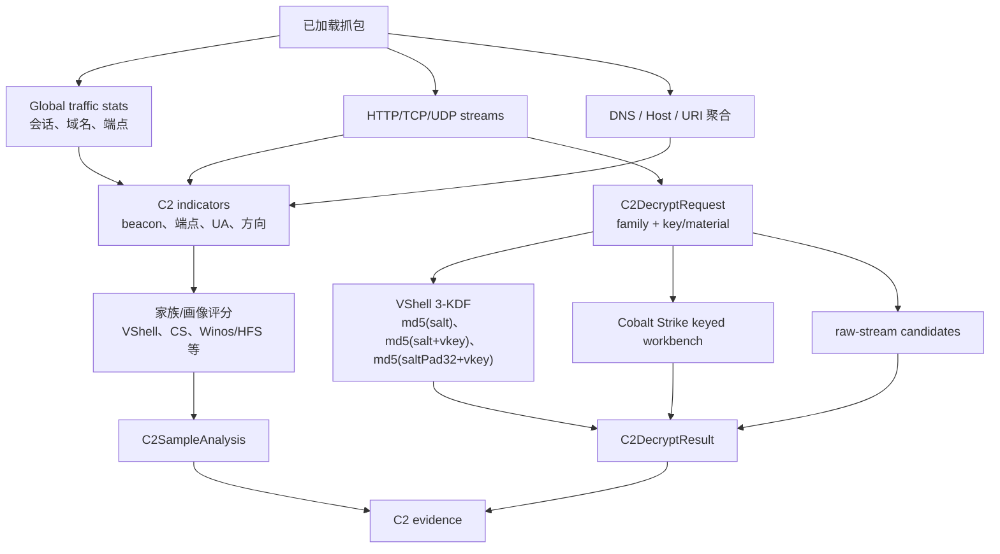
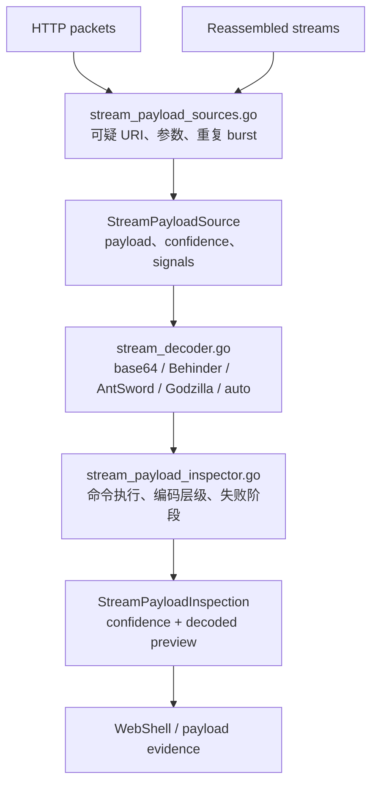
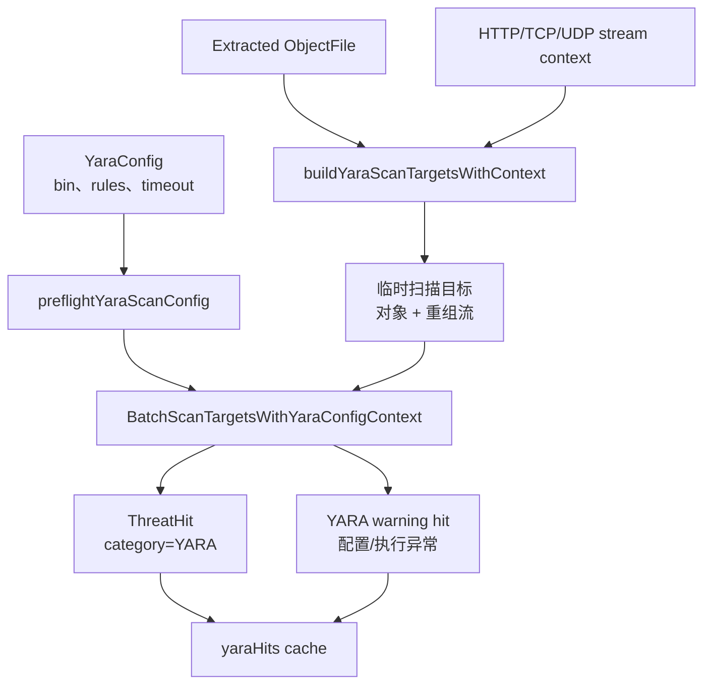
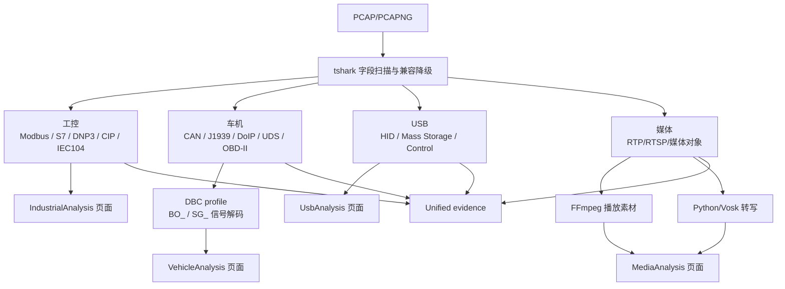
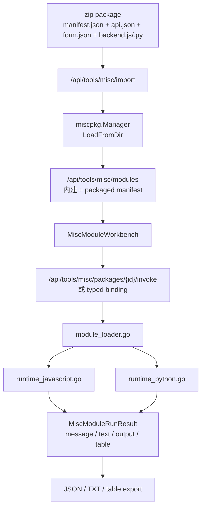

# meow~traffic 架构总览

meow~traffic（内部兼容名：sentinel）是基于 Wails、Go 后端和 React 前端的桌面端离线流量分析应用。本文是当前架构图谱入口，图中的模块名以仓库真实目录、文件和接口为准。整体模型、信任边界、扩展模型和门禁矩阵见 [项目整体模型](../project-model.md)。

## 1. 系统上下文

关键约束：

- 桌面模式的数据面和控制面走 typed Wails IPC，缺 binding 时直接失败。
- 普通浏览器开发模式保留 HTTP REST 与 SSE。
- 两条传输路径最终都汇聚到同一个 `engine.Service`。
- 外部工具能力降级应被报告，不应阻塞应用启动主路径。

## 2. 后端分层

后端维护规则：

- HTTP 路由注册权威来源是 `backend/internal/transport/http_server.go` 和 `misc_modules.go`。
- 新 HTTP handler 必须使用 `WithContext` 变体和 `r.Context()`。
- 领域分析留在 `engine`；外部解析和字段兼容留在 `tshark`；传输、鉴权、审计留在 `transport`。

## 3. 前端数据面

前端维护规则：

- pages/features 不直接调用后端 `fetch`，而是通过 bridge/client。
- wire DTO 表示后端 JSON；mapper 负责归一化；`core/types` 是功能层消费的稳定类型。
- 已迁移桌面数据面缺少 typed binding 时，应以 `generic_ipc_disabled` 失败，不静默回退 HTTP。

## 4. Capture 生命周期

取消链路要求：

- HTTP handler 使用 `r.Context()`。
- 媒体播放、语音转写、YARA、专项分析等长任务必须尊重 context。
- 前端使用 capture task scope 和 abortable request 避免旧抓包结果回写新页面状态。

## 5. Evidence 聚合模型

证据记录应尽量保留 `packet_id`、`stream_id`、来源模块、严重性、置信度、tags、metadata 和 caveats。无法追溯上下文的记录必须显式说明 caveat。

## 6. C2 检测与解密流程

## 7. WebShell Payload 分析流程

## 8. YARA 扫描目标流程

## 9. 专项协议分析流程

## 10. MISC 模块执行流程

MISC 适合低频、高价值、强场景化辅助工具。稳定威胁狩猎能力优先使用 Go 内建检测、YARA 或 playbook；可执行 JS/Python 工具优先使用 MISC zip 模块。
