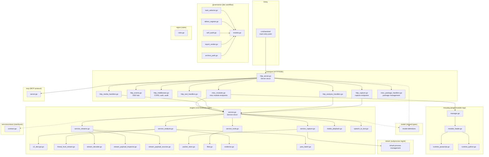
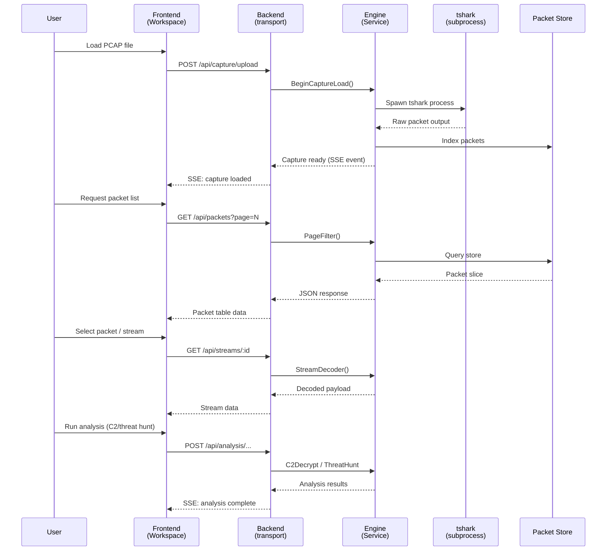

# Architecture Overview

meow~traffic (internal name: sentinel) is a network traffic analysis desktop application built with Wails (Go backend + React frontend).

## 1. Backend Component Diagram

Layered architecture — each layer depends only on the layer below.



**Key packages:**

| Package | Responsibility |
|---|---|
| `cmd/sentinel` | Process entry point, flag parsing, server bootstrap |
| `transport` | HTTP handlers, SSE event hub, CORS/auth/audit middleware |
| `engine` | Core `Service` struct — capture lifecycle, analysis, C2 decrypt, stream decoding, YARA, evidence |
| `tshark` | tshark subprocess lifecycle and output parsing |
| `model` | Shared data types (packets, streams, audit entries) |
| `mcp` | MCP protocol server for tool integration |
| `miscpkg` | Plugin/module manager with JS and Python runtimes |
| `servicecontract` | Shared interfaces between transport and engine |
| `governance` | Dev workflow — task selection, defect tracking, self-audit, report rendering |
| `report` | Investigation report rule definitions |

---

## 2. Frontend Component Diagram

```mermaid
graph TD
    subgraph Entry["Entry Point"]
        MAIN[main.tsx]
        APP[App.tsx]
        ROUTES[routes.tsx]
    end

    subgraph Layout["layouts/"]
        ML[MainLayout.tsx]
        ML_CHROME[MainLayoutChrome.tsx]
        HEADER[MainHeader.tsx]
        FOOTER[MainFooter.tsx]
        SIDEBAR[MainSidebarNav.tsx]
    end

    subgraph State["state/ (Zustand)"]
        SC[SentinelContext.tsx]
        CAP_STATE[capture*State.ts<br/>capture lifecycle]
        PKT_STATE[packet*State.ts<br/>packet filtering/paging]
        STR_STATE[stream*State.ts<br/>stream switching/prefetch]
        TOOL_STATE[tool*State.ts<br/>runtime probe/storage]
        PROG[progressStatus.ts]
    end

    subgraph Pages["pages/"]
        WS[Workspace.tsx]
        AC[AnalysisCockpit.tsx]
        C2[C2Analysis.tsx]
        APT[AptAnalysis.tsx]
        IND[IndustrialAnalysis.tsx]
        VEH[VehicleAnalysis.tsx]
        USB[UsbAnalysis.tsx]
        MED_P[MediaAnalysis.tsx]
        TH_P[ThreatHunting.tsx]
        HTTP_S[HttpStream.tsx]
        TCP_S[TcpStream.tsx]
        UDP_S[UdpStream.tsx]
        RAW[RawStreamPage.tsx]
        EVD_P[EvidencePanel.tsx]
        MTOOLS[MiscTools.tsx]
        OBJ[ObjectExport.tsx]
        UPD[UpdateCenter.tsx]
        TG[TrafficGraph.tsx]
    end

    subgraph Features["features/ (hooks)"]
        F_C2[c2/]
        F_APT[apt/]
        F_IND[industrial/]
        F_VEH[vehicle/]
        F_USB[usb/]
        F_MEDIA[media/]
        F_TRAF[traffic/]
        F_OBJ[object/]
        F_HUNT[hunting/]
        F_EVD[evidence/]
        F_RAW[raw-stream/]
        F_UPD[update/]
    end

    subgraph Components["components/"]
        UI[ui/]
        ANALYSIS[analysis/]
        STREAM_C[stream/]
        WORKSPACE_C[workspace/]
        PKT_V[PacketVirtualTable.tsx]
        CAP_M[CaptureMission*.tsx]
        STR_D[StreamDecoder*.tsx]
        INV_RPT[InvestigationReportPanel.tsx]
        RUNTIME[RuntimeSettings*.tsx]
    end

    subgraph Core["core/"]
        ENGINE[engine.ts]
        CO[captureOverview.ts]
        PC[packetColoring.ts]
        PL[protocolLayer*.ts]
        EVS[evidenceSchema.ts]
        TYPES["types/<br/>15 sub-modules"]
    end

    subgraph Integrations["integrations/"]
        BB[bridgeFactory.ts]
        HTTP_BR[httpBridge.ts]
        DESK_BR[desktopBridge.ts]
        WAILS_BR[wailsBridge.ts]
        DBT[desktopTypedBridge*.ts]
        WIRE[wire/]
        CLIENTS[clients/]
    end

    subgraph Misc["misc/ (MISC tools)"]
        M_REG[registry.tsx]
        M_MOD[modules/]
        M_CAT[useMiscToolsCatalog.ts]
        M_WB[MiscModuleWorkbench.tsx]
    end

    subgraph Hooks["hooks/"]
        HOOKS[shared React hooks]
    end

    subgraph Utils["utils/"]
        UTILS[utility functions]
    end

    MAIN --> APP
    APP --> ROUTES
    ROUTES --> ML
    ML --> ML_CHROME
    ML_CHROME --> HEADER
    ML_CHROME --> FOOTER
    ML_CHROME --> SIDEBAR

    ML --> WS
    ML --> AC
    ML --> C2
    ML --> APT
    ML --> IND
    ML --> VEH
    ML --> USB
    ML --> MED_P
    ML --> TH_P
    ML --> HTTP_S
    ML --> TCP_S
    ML --> UDP_S
    ML --> RAW
    ML --> EVD_P
    ML --> MTOOLS
    ML --> OBJ
    ML --> UPD
    ML --> TG

    APP --> SC

    WS --> SC
    C2 --> SC
    AC --> SC

    SC --> CAP_STATE
    SC --> PKT_STATE
    SC --> STR_STATE
    SC --> TOOL_STATE
    SC --> PROG

    C2 --> F_C2
    APT --> F_APT
    IND --> F_IND
    VEH --> F_VEH
    USB --> F_USB
    MED_P --> F_MEDIA
    TH_P --> F_HUNT
    EVD_P --> F_EVD
    RAW --> F_RAW
    UPD --> F_UPD
    TG --> F_TRAF
    OBJ --> F_OBJ

    WS --> PKT_V
    WS --> CAP_M
    HTTP_S --> STR_D
    TCP_S --> STR_D
    RAW --> STR_D

    F_C2 --> TYPES
    F_APT --> TYPES
    PKT_V --> PC
    AC --> CO
    STR_D --> ENGINE
    INV_RPT --> EVS

    BB --> HTTP_BR
    BB --> DESK_BR
    DESK_BR --> WAILS_BR
    DESK_BR --> DBT
    HTTP_BR --> WIRE
    DBT --> WIRE

    SC --> BB

    MTOOLS --> M_REG
    M_REG --> M_MOD
    MTOOLS --> M_CAT
    MTOOLS --> M_WB
```



**Key directories:**

| Directory | Responsibility |
|---|---|
| `pages/` | Route-level page components (Workspace, C2Analysis, ThreatHunting, etc.) |
| `features/` | Domain-specific hooks and logic (c2, apt, industrial, vehicle, usb, media, etc.) |
| `state/` | Zustand state management — `SentinelContext` orchestrates capture, packet, stream, tool state |
| `components/` | Shared UI — `ui/` (design system), `analysis/`, `stream/`, `workspace/` |
| `core/` | Engine client, packet coloring, protocol layers, evidence schema, `types/` (15 sub-modules) |
| `integrations/` | Bridge layer — `bridgeFactory` routes to `httpBridge` (browser) or `desktopBridge` → `wailsBridge` (desktop) |
| `misc/` | MISC tools framework — module registry, JS/Python runtime catalog, workbench |
| `layouts/` | MainLayout chrome — header, footer, sidebar navigation |
| `hooks/` | Shared React hooks |
| `utils/` | Utility functions |

---

## 3. Data Flow — PCAP Processing Pipeline



**Pipeline stages:**

1. **Upload** — User selects PCAP/PCAPNG file via frontend
2. **Capture** — Backend spawns tshark subprocess, indexes packets into store
3. **Parse** — tshark decodes protocols, engine builds packet metadata
4. **Store** — Packets and streams cached in `packet_store.go`
5. **Analyze** — C2 decrypt, threat hunting, YARA, stream decoding run on demand
6. **Display** — Frontend renders packet table, stream views, analysis results via SSE updates

---

## 4. IPC Communication — Dual Transport

```mermaid
graph LR
    subgraph Frontend["Frontend (React)"]
        APP_F[App.tsx]
        BF[bridgeFactory.ts]
    end

    subgraph Desktop["Desktop Mode (Wails)"]
        WB[wailsBridge.ts]
        DB[desktopBridge.ts]
        DTB[desktopTypedBridge*.ts]
        WAILS_RT[Wails Runtime<br/>(IPC bindings)]
    end

    subgraph Browser["Browser Mode (HTTP)"]
        HB[httpBridge.ts]
        WIRE[wire/<br/>fetch + EventSource]
    end

    subgraph Backend["Backend (Go)"]
        WAILS_APP[app.go<br/>Wails bindings]
        HTTP_SRV[transport/Server<br/>HTTP/SSE]
        ENG[engine/Service]
    end

    APP_F --> BF

    BF -->|desktop detected| DB
    BF -->|browser fallback| HB

    DB --> DTB
    DTB --> WB
    WB --> WAILS_RT
    WAILS_RT --> WAILS_APP
    WAILS_APP --> ENG

    HB --> WIRE
    WIRE -->|fetch /api/*| HTTP_SRV
    WIRE -->|EventSource /api/events| HTTP_SRV
    HTTP_SRV --> ENG
```

**Transport selection:**

| Mode | Transport | Protocol | Use case |
|---|---|---|---|
| Desktop | `wailsBridge` → `desktopBridge` | Wails IPC (Go ↔ JS) | Native app, embedded WebView |
| Browser | `httpBridge` | HTTP REST + SSE | Remote access, development, multi-client |

The `bridgeFactory` auto-detects the runtime environment. In desktop mode, typed bindings (`desktopTypedBridge*.ts`) provide compile-safe IPC for analysis, packet, stream, tooling, media, vehicle, and misc operations. In browser mode, `httpBridge` uses standard `fetch` for REST calls and `EventSource` for server-sent events on `/api/events`.

Both paths converge on the same `engine/Service` — the backend logic is transport-agnostic.
