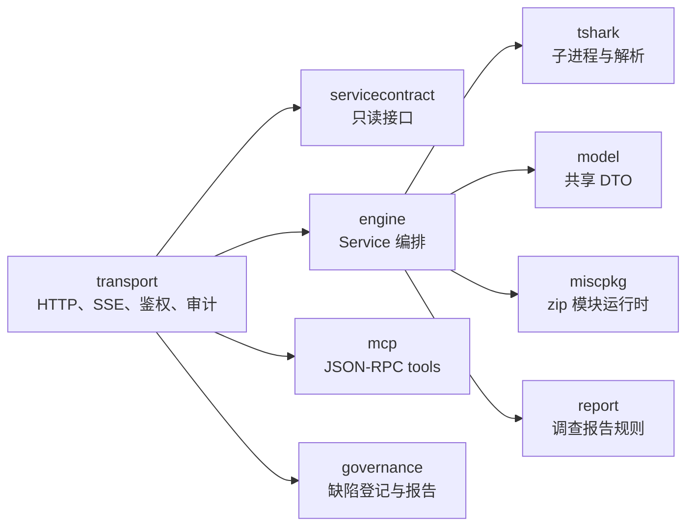
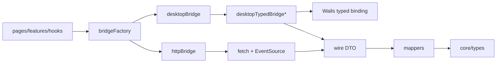

# meow~traffic 设计与工程约束

本文记录当前桌面应用、后端服务、前端传输层和扩展面的工程约束。当代码上下文不足以判断设计取舍时，以本文为默认约束依据。

## 产品边界

meow~traffic 是桌面优先的离线流量分析工作台，面向安全分析师、CTF 选手、应急响应、协议研究、工控/车机流量分析和危险应用研判。后端以 `tshark` 为解析核心，并叠加专项分析、证据聚合、媒体处理、YARA 和 MISC 模块能力。

以下兼容名暂不迁移：

- Go module 仍使用 `github.com/gshark/sentinel/...`。
- 内部目录、事件和缓存路径可能仍使用 `meow-traffic` 或 `sentinel`。
- 内嵌后端二进制仍是 `sentinel-backend.exe`。
- 环境变量仍使用 `MEOW_TRAFFIC_*`。

除非迁移方案覆盖代码、文档、发布资产、用户数据和回滚路径，否则不要直接改名。

## 后端边界

后端 HTTP 使用 `net/http.ServeMux`，路由注册在 `backend/internal/transport/http_server.go`。不要按 chi/gin/echo 的模式设计 handler。

分层约束：



约束：

- 新 HTTP handler 必须把 `r.Context()` 传给 `WithContext` 服务方法。
- `context.Background()` 包装方法只为桌面同步 binding 兼容保留，不要在 HTTP handler 中使用。
- 长任务必须能被请求取消、抓包替换或关闭流程中断。
- 传输层逻辑留在 `transport`；tshark 子进程逻辑留在 `tshark`；领域分析逻辑留在 `engine`。
- Go 只使用 `gofmt` 格式化。

正确 HTTP handler 模式：

```go
result, err := s.analysis.VehicleAnalysisWithContext(r.Context())
```

错误模式：

```go
result, err := s.analysis.VehicleAnalysis()
```

## 前端边界

前端数据面通过 bridge 抽象传输：



约束：

- 桌面数据面调用必须优先走明确的 typed Wails binding。
- 已迁移的桌面数据面缺少 typed binding 时，应以 `generic_ipc_disabled` 失败，不允许静默回退到浏览器 HTTP。
- 普通 browser-dev 模式继续使用 HTTP REST 和 SSE。
- wire DTO 表示后端 JSON；mapper 负责归一化到 `core/types`；feature hooks 和 pages 只消费归一化类型。
- 避免在 pages/features 中直接 `fetch` 后端；应新增 bridge/client 方法。
- 前端包管理保持 `pnpm`，保留 `frontend/pnpm-lock.yaml`。
- Vite 配置不得把 `.css`、`.tsx`、`.ts` 加入 `assetsInclude`。

## API 与 IPC 契约

HTTP route 权威来源：

- `backend/internal/transport/http_server.go`
- `backend/internal/transport/misc_modules.go`
- `docs/api/openapi.yaml`

桌面 IPC 权威来源：

- `app.go`
- `frontend/wailsjs/go/main/DesktopApp.d.ts`
- `frontend/src/app/integrations/desktopTypedBridgeRequirements.ts`
- `frontend/src/app/integrations/desktopTypedBridge*.ts`

维护要求：

- 每个新增 HTTP route 都要同步 OpenAPI。
- 每个新增 typed 桌面数据面 binding 都要进入前端 bridge requirements。
- 每个供前端消费的新后端 JSON shape 都应有 wire DTO 和 mapper；MISC 动态输出等明确动态结构除外。

## 证据模型

证据是跨模块调查主契约。后端聚合入口是 `backend/internal/engine/evidence.go`；前端展示使用 `frontend/src/app/core/types/evidence.ts` 中的 `UnifiedEvidenceRecord` 以及 evidence feature 的 re-export。

产出证据的模块应保留：

- `module` 或 `source_module`
- `severity`
- `confidence`
- 可用时保留 `packet_id` 和/或 `stream_id`
- 足以让分析员解释结论的 `metadata`、`tags` 和 `caveats`

不要新增无法追溯到包、流、对象、模块或明确 caveat 的证据记录。

## 安全与运行时约束

- 后端 API 在设置或自动生成 `MEOW_TRAFFIC_BACKEND_TOKEN` 后使用 bearer token。
- `/health`、`/api/events`、`/api/audit/logs` 在 middleware 中有特殊鉴权处理；修改暴露面前先检查 `http_middleware.go`。
- 桌面事件应通过 Wails runtime events 桥接，不要让 WebView 页面直连 `/api/events`。
- 桌面 blob 响应有大小上限，避免 WebView 内存尖峰。
- zip MISC 模块通过受控 JavaScript/Python 运行时执行，不要把任意压缩包内容视为可信。
- 外部工具（`tshark`、FFmpeg、Python、Vosk、YARA）必须清晰报告降级状态，不能阻塞应用启动主路径。

## CI 与格式约束

后端 CI：

- `gofmt -l .`
- 后端架构边界测试
- 证据/报告/公开样本/governance 聚焦测试
- feature gap remediation 聚焦测试
- `go test ./...`

前端 CI：

- Corepack + `pnpm@10.31.0`
- `pnpm install --frozen-lockfile`
- `pnpm run ci`

桌面 CI：

- `pnpm run build:wails`
- 桌面资源检查
- 根模块 `dev` 和 `production` tag 测试

具体本地命令见 [项目开发指南](./project-development-guide.md)。

