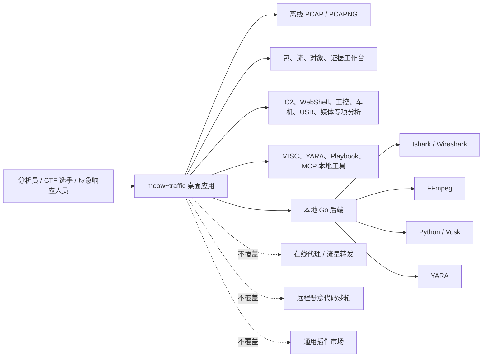
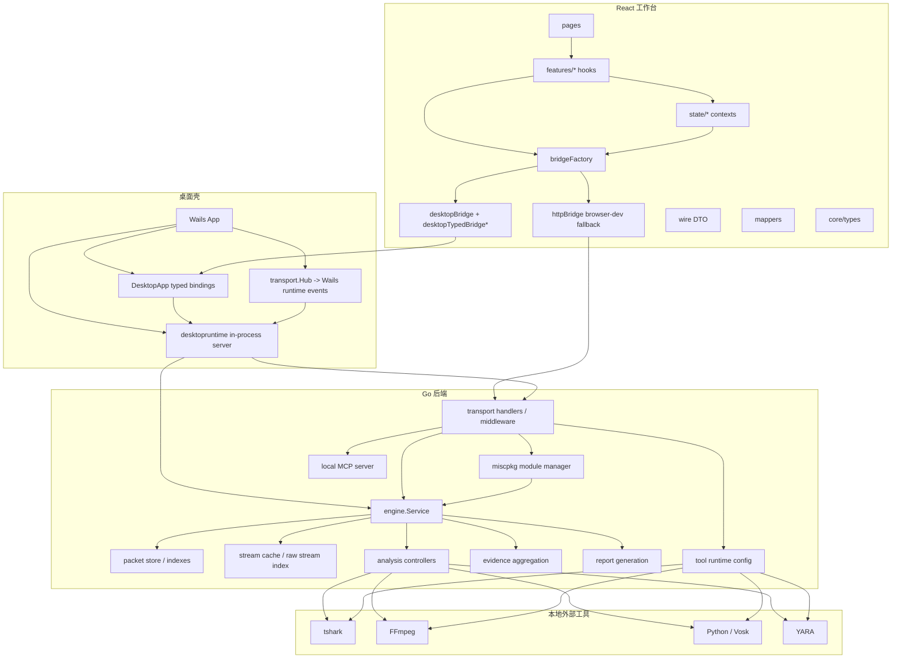
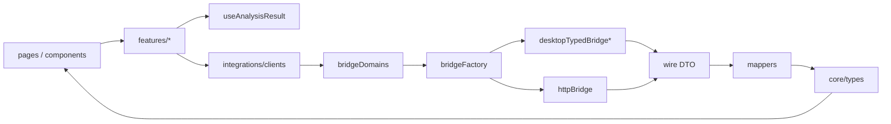
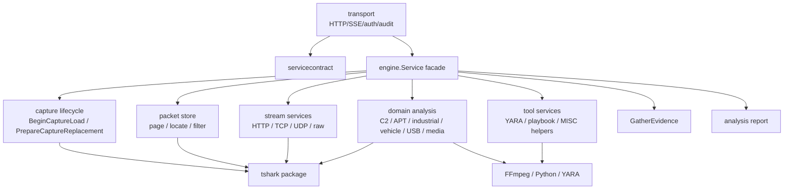
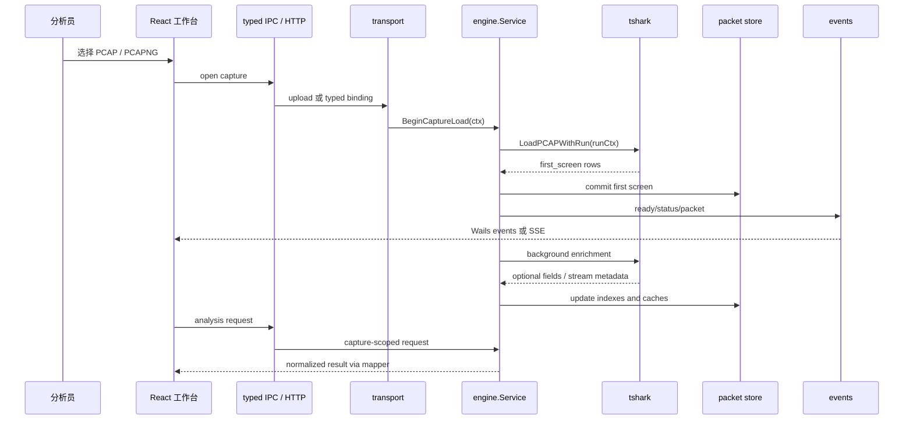
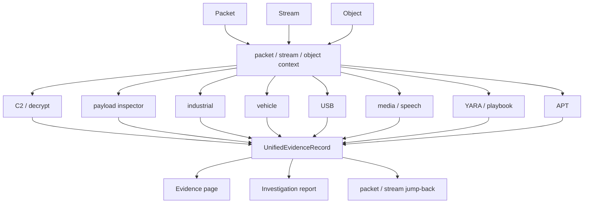
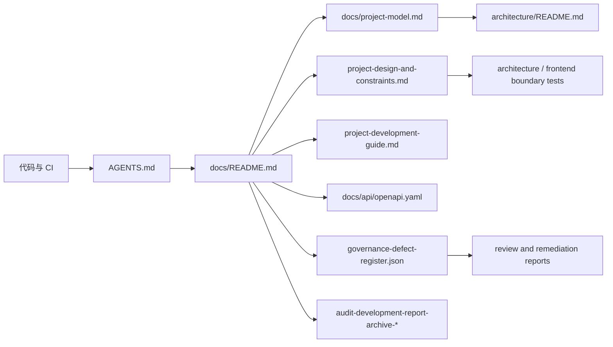

# meow~traffic 项目整体模型

> 建模日期：2026-06-23。本文描述当前仓库的系统模型、模块边界、数据流、信任边界和治理门禁。具体实现以代码、CI、`AGENTS.md`、OpenAPI 与本模型共同校准；历史审计归档只作为证据链，不直接代表当前实现。

## 1. 建模目标

本模型用于回答四类问题：

- 项目是什么：离线流量分析桌面工作台，不是在线流量代理或通用插件市场。
- 系统由什么组成：Wails 桌面壳、React 工作台、本地 Go 后端、外部解析工具和 MISC 扩展面。
- 数据如何流动：PCAP 进入 capture 生命周期，经 packet store、stream cache、专项分析和证据聚合输出到工作台与报告。
- 变更如何受控：通过 context 契约、typed IPC、路径/签名/鉴权规则、CI 和治理登记表约束。

## 2. 产品上下文



产品主线是“离线包取证 + 协议专项研判 + 证据链回跳”。外部工具缺失时应显示降级状态，不能让应用启动主路径失败。

## 3. 仓库与运行时分层

| 层级 | 目录/入口 | 主要职责 | 约束 |
| --- | --- | --- | --- |
| 桌面壳 | `main.go`、`app.go`、`desktop_*.go` | Wails 生命周期、前端嵌入、typed binding、进程内后端 runtime 挂载与事件转发 | 根入口必须带 `dev || production` build tag；`bindings` tag 仅供 Wails 生成 |
| 前端工作台 | `frontend/src/app` | 页面、组件、状态、bridge、wire DTO、mapper、核心类型 | `pnpm` only；桌面数据面 typed IPC 优先 |
| 后端服务 | `backend/internal/transport` | HTTP/SSE、鉴权、审计、OpenAPI 契约、MISC HTTP 端点 | `net/http.ServeMux`；handler 使用 `r.Context()` |
| 后端编排 | `backend/internal/engine` | capture、packet、stream、analysis、evidence、report、tool runtime | 新长任务必须有 `WithContext` 变体 |
| 解析适配 | `backend/internal/tshark` | tshark 子进程、字段扫描、媒体/协议提取辅助 | 字段缺失按 capability degraded 处理 |
| 扩展运行时 | `backend/internal/miscpkg` | MISC zip 导入、签名、manifest、JS/Python runtime | 生产构建强制签名；zip 大小与路径受限 |
| 工具运行时 | `backend/internal/tool` | 可执行文件路径校验、allowlist、runtime config | 危险路径硬拦截；非默认目录 warning + 快捷加白 |
| 契约与治理 | `backend/internal/model`、`servicecontract`、`governance`、`docs` | DTO、跨层接口、缺陷登记、规则文档 | 文档与测试共同作为门禁 |

## 4. C4 组件模型



## 5. 前端模型

前端以“传输隔离 + 类型归一 + capture-scoped 状态”为核心。



维护规则：

- `pages`、`features` 不直接 `fetch` 后端数据面。
- 后端 JSON shape 先进入 `wire`，再经 mapper 转成 `core/types`。
- 分析 hook 使用 capture revision、filePath、totalPackets、force refresh 和 inflight 去重作为缓存键语义。
- 桌面模式缺少已迁移 typed binding 时返回 `generic_ipc_disabled`，不静默回退 HTTP。
- `clients`、`mappers`、`wire` 层不新增裸 `any`；需要动态结构必须登记治理例外。

## 6. 后端模型

后端以 `engine.Service` 作为 transport 与桌面 binding 的稳定门面，内部由 capture、packet、stream、analysis、tool、evidence 等 controller 分担状态。



维护规则：

- 新 HTTP handler 使用 `WithContext` 服务方法。
- 新 service facade 跨 controller 方法登记到架构边界测试。
- `engine` 根包新增生产文件登记领域归属。
- 大文件必须拆分或进入 grandfathered 列表并说明理由。
- `transport` 不新增调用无 context 长任务的代码。

## 7. 核心数据生命周期



取消与替换规则：

- HTTP 请求取消、抓包替换、应用关闭都必须能中断长任务。
- 前端旧请求返回时必须被 capture scope 拦截，不能污染新抓包状态。
- 后端错误要保留底层 cause，展示层再转换为用户可读提示。

## 8. 证据模型



证据记录最低要求：

- 来源模块：`module` 或 `source_module`。
- 判断属性：`severity`、`confidence`、`tags`。
- 可追溯上下文：packet、stream、object、flow、host 或明确 caveat。
- 解释材料：`metadata`、decoded preview、rule name、signals 或 family reason。

不能新增“看起来像结论但无法回跳或解释”的证据。

## 9. 安全与信任边界

| 边界 | 输入 | 风险 | 当前门禁 |
| --- | --- | --- | --- |
| HTTP API | WebView/browser-dev 请求 | 未授权访问、长任务不可取消 | bearer token、CORS/origin、`WithContext` |
| SSE/event | 后端事件 | token 泄漏、页面直连 | 桌面事件桥，前端 EventSource 改为 header auth fetch stream |
| 可执行工具路径 | tshark/FFmpeg/Python/YARA 路径 | 路径劫持、脚本冒充 | basename、扩展名、绝对路径、目录/符号链接检查、allowlist |
| tshark 非默认路径 | 用户指定二进制 | 合法便携安装被误拦 | warning + 快捷加白，不阻止运行 |
| MISC zip | 用户导入模块 | 路径穿越、未签名、任意脚本 | 32MB 限制、规范化签名、生产强制签名、JS/Python 子进程隔离、最小环境 |
| 文件路径 | 上传/导出/规则路径 | 路径穿越 | base-dir 校验，禁止只看 `..` 字符串 |
| 远程下载 | 规则更新/URL | SSRF、缓存投毒 | URL scheme/host 校验、HTTP timeout、checksum |
| crypto | C2 解密辅助 | 硬编码 IV、key-as-IV | 明确算法边界和测试样本 |

MISC zip 自定义模块仍是本地可信扩展点。JavaScript 与 Python 后端脚本以子进程运行，宿主只通过受控 JSON 协议提供 `host.scan` 等能力；但它仍不等价于面向未知恶意代码的完整系统沙箱。需要强隔离时应叠加系统级沙箱或虚拟机策略。

## 10. 扩展模型

| 扩展类型 | 适用场景 | 接入位置 | 何时不适用 |
| --- | --- | --- | --- |
| Go 内建分析 | 高频、稳定、需证据回跳的能力 | `backend/internal/engine` + frontend feature | 一次性小工具 |
| YARA | 文件/流目标规则匹配 | `yara_batch.go`、规则配置 | 需要复杂状态机的协议分析 |
| Playbook / Threat hunting | 多信号规则编排 | hunting feature + backend tools | 低层解析能力不足时 |
| MISC zip | 低频、高价值、强场景辅助 | `miscpkg` + MISC workbench | 不可信代码、复杂 UI、长期核心能力 |
| MCP | 本地只读工具/资源暴露 | `backend/internal/mcp` | 需要修改应用状态的控制面 |
| Typed IPC binding | 桌面数据面/控制面 | `app.go` + `desktopTypedBridge*` | 普通 browser-dev 专用接口 |

新增扩展能力时，应优先判断它属于“核心分析能力”还是“辅助工具”。核心能力应进入 Go 后端并覆盖证据回跳；辅助工具优先 MISC 或 Playbook。

## 11. 文档与治理模型



权威优先级：

1. 代码、测试、CI 配置和构建脚本。
2. `AGENTS.md` 与安全修复手册。
3. 根 README、`docs/README.md`、本项目模型、架构/约束/开发指南。
4. OpenAPI、MISC 接口、MCP 接口等专项契约。
5. 治理缺陷登记表和阶段报告。
6. 历史审计归档。

历史归档可以被版本化保存，但不作为当前事实源。若历史报告中的事实需要继续约束开发，必须沉淀到当前文档、测试或治理登记表。

## 12. 变更门禁矩阵

| 变更 | 必须同步 | 推荐验证 |
| --- | --- | --- |
| 新 HTTP route | `docs/api/openapi.yaml`、transport tests | `cd backend && go test ./internal/transport` |
| 新长任务 handler | `WithContext` 服务方法、边界测试 | `cd backend && go test ./internal/architecture` |
| 新 engine 根文件 | `engineDomainOwners()` | `cd backend && go test ./internal/architecture` |
| 新 typed binding | `app.go`、Wails d.ts、desktopTypedBridge、requirements | `cd frontend && pnpm run ci:desktop` |
| 新前端 DTO | wire DTO、mapper、core type、type governance | `cd frontend && pnpm run ci:boundaries` |
| 新外部工具路径配置 | `backend/internal/tool` validator、前端 warning/allow UI | backend tool tests + frontend runtime tests |
| 新 MISC 包能力 | `docs/misc-module-interface.md`、签名/权限测试 | `cd backend && go test ./internal/miscpkg` |
| 新安全修复 | `docs/security-fix-playbook.md` 或治理登记表 | `scripts/check-all.ps1` |
| 新开发规则 | `AGENTS.md`、`docs/project-development-guide.md` | 文档 diff + 相关门禁 |

完整交付前建议运行：

```powershell
powershell -ExecutionPolicy Bypass -File .\scripts\check-all.ps1
```

## 13. 当前残余风险

- MISC JavaScript/Python 自定义模块已离开后端主进程执行，并通过生产签名、最小环境和权限门禁降低风险；它仍不是完整系统级恶意代码沙箱。
- 超大抓包、超大流和媒体批处理仍需要持续增量化与内存尖峰压测。
- Desktop typed IPC 已是主线，但新增数据面仍需持续补齐 binding 和 requirements，避免重新引入 generic IPC。
- 证据模型已经统一，但各专项模块的 confidence、caveats 和回跳粒度仍需随真实样本持续校准。
